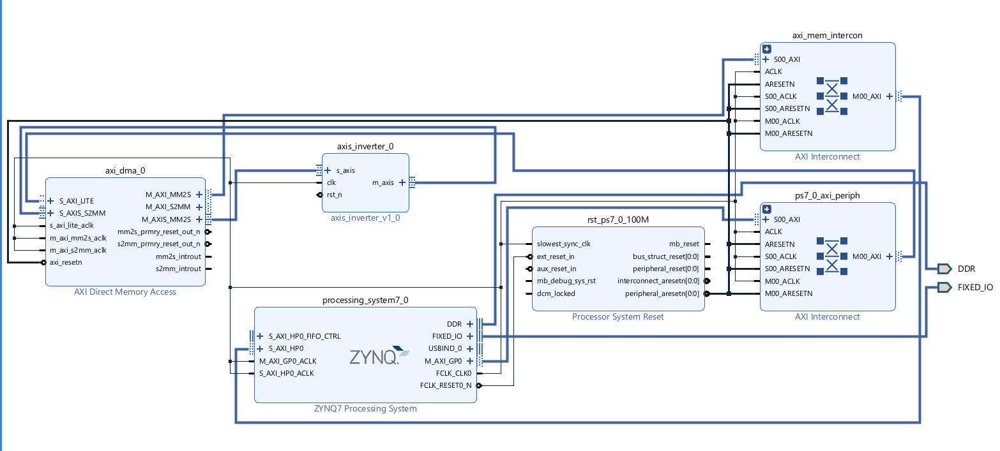
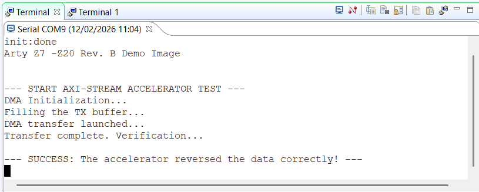

# AXI4-Stream Data Accelerator on Zynq-7000


## 🚀 Project Overview
This project demonstrates a high-performance **Hardware-Software Co-design** architecture on the Digilent Arty Z7-20 (Xilinx Zynq-7000 SoC). 

It implements a custom hardware accelerator (RTL) capable of processing data streams via **AXI DMA** (Direct Memory Access). The system offloads processing tasks from the ARM Cortex-A9 processor to the FPGA fabric, ensuring efficient data movement and cache coherency.

**Key Features:**
* **Custom IP Design:** AXI4-Stream compliant Verilog module.
* **System Integration:** AXI DMA, AXI Interconnect, and Zynq PS via Vivado IP Integrator.
* **Embedded Software:** Bare-metal C driver handling DMA transfers, Cache flushing/invalidation, and verification.
* **Verification:** SystemVerilog testbench for the AXI-Stream interface.

## 🏗️ System Architecture



**Data Flow:**
1.  **CPU (PS):** Generates data in DDR Memory.
2.  **DMA (MM2S):** Reads data from DDR and streams it to the FPGA IP.
3.  **Accelerator (PL):** Processes data (Bitwise Inversion) at wire speed.
4.  **DMA (S2MM):** Writes the processed data back to DDR Memory.
5.  **CPU (PS):** Verifies the results.


## 🧩 Custom IP Details: `axis_inverter`
The heart of the accelerator is a custom Verilog module designed to demonstrate **AXI4-Stream protocol compliance**.

**Functionality:**
It performs a bitwise NOT operation on the incoming 32-bit integer stream (Hardware Inversion).
* **Input:**  `0x000000AA`
* **Output:** `0xFFFFFF55`

**Architecture (Zero-Latency Passthrough):**
To maximize throughput, the module is implemented using purely combinatorial logic. It acts as a "smart wire" within the pipeline:

1.  **Data Path:** The inversion happens instantly (`assign m_data = ~s_data`).
2.  **Flow Control:** The `TREADY` and `TVALID` handshake signals are directly propagated. If the downstream DMA (S2MM) applies backpressure (sets Ready to 0), the inverter immediately stops accepting data from the upstream DMA (MM2S).
3.  **Side-Band Signals:** Crucially, the **`TLAST`** signal is preserved and forwarded. This ensures the receiving DMA channel knows exactly when the packet ends, preventing system hangs.

```verilog
// Simplified RTL Logic
assign m_axis_tdata  = ~s_axis_tdata;  // Bitwise NOT
assign m_axis_tvalid = s_axis_tvalid;  // Valid propagation
assign s_axis_tready = m_axis_tready;  // Backpressure propagation
assign m_axis_tlast  = s_axis_tlast;   // Packet boundary preservation
```


## 📂 Repository Structure

```text
.
├── hw/                 # Hardware Design
│   ├── src/            # Verilog/SystemVerilog sources (Accelerator IP)
├── sw/                 # Embedded Software
│   └── src/            # C source code (DMA driver and Main application)
└── docs/               # Documentation and diagrams
```


## 🛠️ Prerequisites
- **Hardware**: Digilent Arty Z7-20 (or any Zynq-7000 board with adaptation).
- **Software**: Xilinx Vivado & Vitis (2024.1 or newer recommended).
- **Terminal**: Tera Term, PuTTY, or Vitis Serial Terminal.


## ⚙️ How to Build & Run

### 1. Hardware Generation (Vivado)
To recreate the project from scratch without scripts:

#### A. Project Setup
1.  Open Vivado and click **Create Project**.
2.  Select **RTL Project** and check "Do not specify sources at this time".
3.  **Board Selection:** Search for and select **Arty Z7-20**. Finish.
4.  **Add Source:** Click "Add Sources" (Alt+A) &rarr; "Add or create design sources" &rarr; Add `hw/src/axis_inverter.v`.

#### B. IP Packaging
To use the Verilog module in the Block Design, we must package it as an IP.
1.  Go to **Tools &rarr; Create and Package New IP**.
2.  Select **"Package your current project"**.
3.  In the "Package IP" tab, check **Ports and Interfaces**. Ensure `s_axis` and `m_axis` are grouped as interfaces.
4.  Go to **Review and Package** and click **Package IP**.

#### C. Block Design Creation
1.  Click **Create Block Design** and name it `system`.
2.  **Add ZYNQ Processing System:**
    * Add the IP. Click **Run Block Automation** (Apply Board Presets).
    * Double-click Zynq &rarr; PS-PL Configuration &rarr; HP Slave AXI Interface &rarr; Check **S AXI HP0 interface**.
3.  **Add AXI Direct Memory Access (DMA):**
    * Disable "Scatter Gather Engine".
    * Set "Width of Buffer Length Register" to 14.
4.  **Add Custom IP:**
    * Add `axis_inverter_0` (The IP you just packaged).

#### D. Connection & Wiring
1.  **Run Connection Automation:** Check all boxes (S_AXI_LITE, S_AXI_HP0, etc.). This will create the Interconnects and Reset blocks.
2.  **Manual Data Routing (The Loop):**
    * Connect DMA `M_AXIS_MM2S` &rarr; Inverter `s_axis`.
    * Connect Inverter `m_axis` &rarr; DMA `S_AXIS_S2MM`.
3.  **Critical Reset Fix:**
    * Manually connect `axis_inverter_0/rst_n` to the `peripheral_aresetn` pin of the Processor System Reset block.

#### E. Build Bitstream
1.  **Validate Design** (F6) to ensure no errors.
2.  In "Sources" tab, right-click `system.bd` &rarr; **Create HDL Wrapper** (Let Vivado manage).
3.  Click **Generate Bitstream**.
4.  **Export Hardware:** File &rarr; Export &rarr; Export Hardware (Select **"Include bitstream"**). Save as `system_wrapper.xsa`.

### 2. Software Setup (Vitis)

1. Open Vitis IDE and create a new workspace.
2. **Create Platform Project:**
    * Select the `.xsa` file exported from Vivado.
    * OS: `standalone` (for bare-metal), Processor: `ps7_cortexa9_0`.
    * **IMPORTANT**: Check "Generate Boot Components."
3. **Create Application Project:**
    * Select the platform created above.
    * Template: "Empty Application" or "Hello World".
4. **Import Source:**
    * Copy the content of `sw/src/main.c` into your application's source folder.
5. Build the project (🔨 Hammer icon)

### 3. Execution

1. Connect the Arty Z7 to your PC via USB.
2. In Vitis, roght-click the application **&rarr; Run As &rarr; 1 Launch Hardware (Single Application Debug)**
    * *Note:* Vitis will automatically program the FPGA bitstream and load the C code.


## 🐞 Debugging & Console Output
To see the application output, you must configure a Serial Terminal **before** running the code.

**Using Vitis Serial Terminal:**

1. Open the **Vitis Serial Terminal** tab (Window &rarr; Show View &rarr; Terminal).
2. Click the + icon to connect.
3. **Setting:** 
    * **Port:** COMx (Check Device Manager for "USB Serial Port").
    * **Baud Rate:** 115200
    * **Data/Stop/Parity:** 8 / 1 / None.
4. **Launch the Run**

**Expected Output**
```text
init:done
Arty Z7 -Z20 Rev. B Demo Image

--- START AXI-STREAM ACCELERATOR TEST ---
DMA Initialization...
Filling the TX buffer...
DMA transfer launched...
Transfer complete. Verification...

--- SUCCESS: The accelerator reversed the data correctly! ---
```



## ⚠️ Common Issues
- **Terminal is empty:** The program runs too fast. Connect the terminal before running, or press the **RESET** button on the board (Red button) to restart the execution.

- **"Platform.h not found":** If you chose "Empty Application", remove `#include "platform.h"`, `init_platform()` and `cleanup_platform` calls from the main C file.

- **DMA Transfer Fails:** Ensure `TLAST` signal is correctly propagated in the Verilog IP.